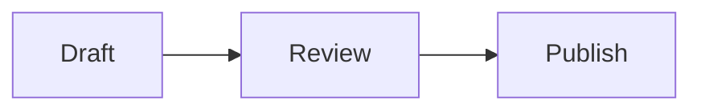

# Markdown and Editor Guide

MinuNotes uses Markdown with a live editor. You can type plain text, use Markdown syntax directly, or use slash commands for common blocks.

## Basic Markdown

```md
# Heading 1
## Heading 2
### Heading 3

Normal paragraph text.

- Bulleted list
- Another item

1. Numbered list
2. Another item

- [ ] Open task
- [x] Completed task

> Quote

**Bold** and *italic* text

[External link](https://example.com)
```

## Code

Inline code:

```md
Use `pnpm build` to build the app.
```

Code block:

````md
```ts
const message = "hello";
```
````

## Tables

```md
| Name | Status |
| --- | --- |
| Share links | Done |
| OAuth | Planned |
```

## Images

Use the image command or paste/insert Markdown image syntax:

```md

```

Uploaded app images use MinuNotes attachment URLs. Keep those URLs unchanged when editing notes manually or with agents.

## Callouts

Use GitHub-style callouts for information that needs a semantic status:

```md
> [!NOTE]
> Useful context for the reader.

> [!TIP]
> A recommended approach.

> [!IMPORTANT]
> Required information.

> [!WARNING]
> Something that needs attention.

> [!CAUTION]
> A risky or destructive action.
```

Callouts remain portable blockquote Markdown. Unknown or malformed callout markers render as normal quotes.

## Mermaid diagrams

Mermaid fenced blocks render as diagrams in Live mode and shared/read-only notes:

````md

````

Use **Edit source** on a diagram or switch to Source mode to edit its Markdown. Invalid diagrams retain their source and show an error rather than discarding content.

## Rich paste

Pasting formatted browser, Google Docs, or Notion content converts safe headings, formatting, links, lists, quotes, tables, and code into Markdown. Pasting spreadsheet cells converts tab-delimited content into a Markdown table. Use `Cmd/Ctrl+Shift+V` when you want plain text instead.

Pasted image files continue to use MinuNotes attachment storage.

## Slash commands

Type `/` at the start of an empty line to open the slash command menu.

Common commands include:

- Heading 1
- Heading 2
- Heading 3
- Bulleted List
- Numbered List
- Task List
- Quote
- Code Block
- Table
- Divider
- Image
- Wiki Link

Use arrow keys to select an option and press Enter. You can also keep typing to filter the command list.

## Wikilinks

Use wikilinks to connect notes together:

```md
[[Note Title]]
```

Use a label when you want different visible text:

```md
[[Note Title|visible label]]
```

Typing `[[` opens note suggestions. Selecting a suggestion inserts an ID-backed link while showing the note title:

```md
[[note_abc123|Note Title]]
```

The ID keeps a link stable when the target is renamed or when multiple notes have the same title. The editor displays `Note Title`, not the ID, when the link is inactive.

Clicking a wikilink opens the target note when MinuNotes can resolve it.

## Duplicate note titles and older links

Older title-only wikilinks resolve by title when there is exactly one matching note. If multiple notes have the same title, they stay unresolved rather than opening an arbitrary note.

To repair an older ambiguous link, edit its target and select the intended note from the suggestions. MinuNotes replaces it with an ID-backed link. It never rewrites existing links automatically.

## Backlinks

Backlinks are created automatically when one note links to another with:

- `[[wikilinks]]`
- `[[wikilinks|with labels]]`
- internal MinuNotes note URLs

When a note has backlinks, a `Backlinks N` button appears near the top of the note on desktop/tablet. Open it to see notes that reference the current note.

If a note has no backlinks, no backlinks button is shown.

## Tags

Tags are managed from **Note actions → Details**.

Tag names are lowercase words and may use dashes:

```txt
plan
research
release-notes
```

Tags are lightweight labels for organization and search. They are not a custom database/property system.

## Note details

Open **Note actions → Details** to view or edit built-in metadata:

- Name
- Created date
- API editable
- Tags

The Details panel also shows read-only metadata such as folder, type, updated date, and updated-by information.
