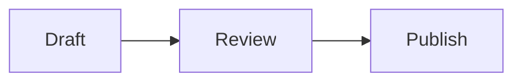

# Markdown and editor

MinuNotes uses Markdown with a live editor. You can type plain text, use Markdown syntax directly, or use slash commands for common blocks.

Markdown notes open in live mode, which renders formatting and rich blocks while you edit. Choose **Source mode** from the note actions menu to see the raw Markdown, including formatting markers, image syntax, tables, and code fences. Use **Live mode** in the same menu to switch back. Changes autosave in either mode.

## Basic Markdown

```md
# Heading 1
## Heading 2
### Heading 3

Normal paragraph text.

- Bulleted list
- Another item

1. Numbered list
2. Another item

- [ ] Open task
- [x] Completed task

> Quote

**Bold** and *italic* text

[External link](https://example.com)
```

## Code

Inline code:

```md
Use `pnpm build` to build the app.
```

Code block:

````md
```ts
const message = "hello";
```
````

## Tables

```md
| Name | Status |
| --- | --- |
| Share links | Done |
| OAuth | Planned |
```

## Images

Use the image command or Markdown image syntax:

```md

```

Uploaded app images use MinuNotes attachment URLs. Keep those URLs unchanged when editing notes manually or with agents.

## Callouts

Use GitHub-style callouts for information that needs a semantic status:

```md
> [!NOTE]
> Useful context for the reader.

> [!TIP]
> A recommended approach.

> [!IMPORTANT]
> Required information.

> [!WARNING]
> Something that needs attention.

> [!CAUTION]
> A risky or destructive action.
```

Callouts remain portable blockquote Markdown. Unknown or malformed callout markers render as normal quotes.

## Mermaid diagrams

Mermaid fenced blocks render as diagrams in Live mode and shared/read-only notes:

````md

````

Use **Edit source** on a diagram or switch to Source mode to edit its Markdown. Invalid diagrams retain their source and show an error rather than discarding content.

## Rich paste

Pasting formatted browser, Google Docs, or Notion content converts safe headings, formatting, links, lists, quotes, tables, and code into Markdown. Pasting spreadsheet cells converts tab-delimited content into a Markdown table. Use `Cmd/Ctrl+Shift+V` when you want plain text instead.

Pasted image files continue to use MinuNotes attachment storage.
